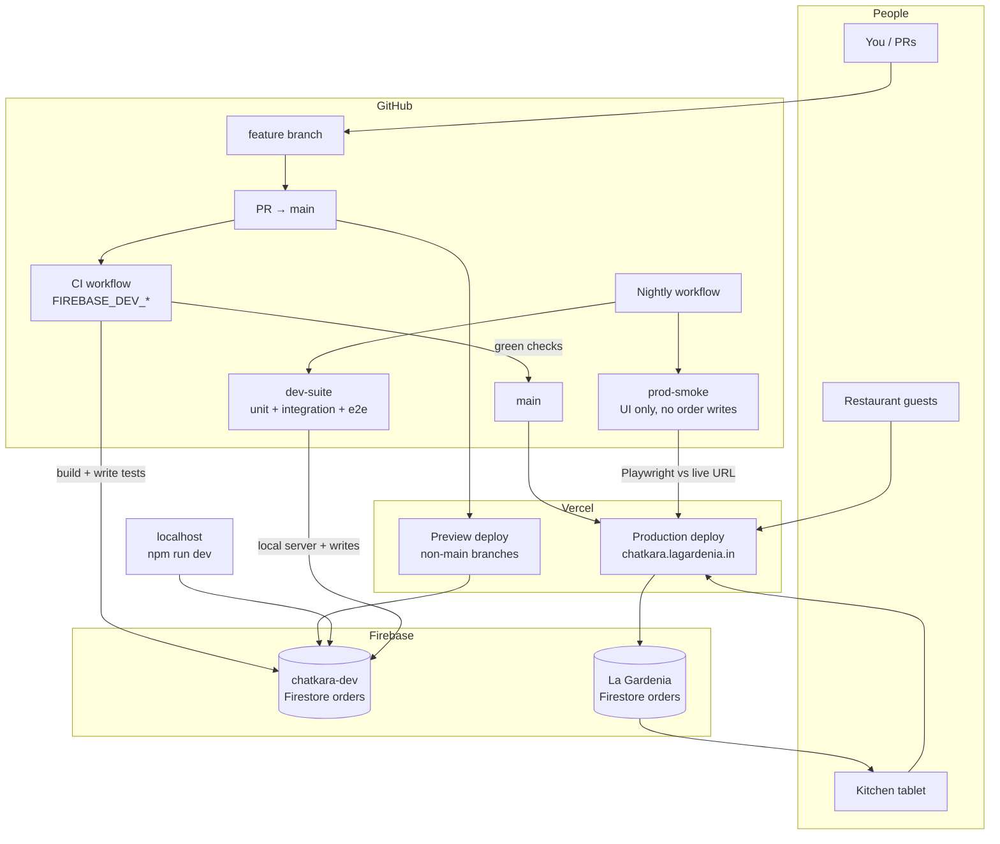

# ChatKara POS

QR-code table ordering for **ChatKara — Flavours of India** (Bokaro, Jharkhand).

Live URL: [https://chatkara.lagardenia.in](https://chatkara.lagardenia.in)

## Features

- **Table QR ordering** — guests scan a code → `/table/1` … `/table/7`
- **Official PDF Menu & Prices** — accurate pricing configured in `src/lib/menu.ts` extracted directly from `chatkara menu (1).pdf`
- **Payments** — UPI (GPay / PhonePe / Paytm deep link + QR) and cash at table
- **Kitchen POS** — live order board at `/kitchen`
- **Printable QR sheet** — `/admin/qr`

## Prerequisites

This project uses [mise](https://mise.jdx.dev/) for Node (no global Node install). Pin is in `mise.toml` (`node = "20"`).

```bash
mise trust
mise install   # uses Node 20 from mise
```

## Environments (Development vs Production)

Use **two Firebase projects** so kitchen/test orders never mix with live orders.

| Environment | Where it runs | Firebase project |
|---|---|---|
| **Development** | Local (`npm run dev`), Vercel **Preview** (non-`main` branches), GitHub CI/nightly | `chatkara-dev` |
| **Production** | Vercel **Production** (`main` only → `chatkara.lagardenia.in`) | `la-gardenia-502619` (live) |

### Infrastructure



### Deploy + merge flow

1. Create a feature branch (never push straight to `main`).
2. Open a PR into `main`.
3. **Vercel** deploys a Preview URL for that branch (wired to **chatkara-dev** Firebase).
4. **GitHub Actions `CI`** builds a local server with **`FIREBASE_DEV_*`** secrets and runs lint/build/unit/integration/e2e (all order writes → **chatkara-dev**).
5. Merge to `main` only when CI is green (branch protection blocks otherwise).
6. Vercel then deploys **Production** from `main` (wired to **La Gardenia** Firebase).

### Nightly

| Job | Hits | Database for test orders |
|---|---|---|
| **Production URL smoke** | Live site (`https://chatkara.lagardenia.in`) | None — e2e is UI/cart only (no order API writes) |
| **Dev suite** | Local CI server | **chatkara-dev** (`FIREBASE_DEV_*`) — integration writes stay here |

**Important:** You cannot hit the Production URL and store orders in the Dev database. The live site always uses Production Firebase (Vercel). That’s why nightly is split.

### Setup

1. Keep **La Gardenia** as production Firebase; use **chatkara-dev** for development.
2. Enable **Cloud Firestore** on `chatkara-dev` (`(default)` database).
3. Local `.env.local` → `chatkara-dev` credentials + `CHATKARA_ENV=development`.
4. **Vercel → Environment Variables**:
   - **Production** → La Gardenia `FIREBASE_*` + `CHATKARA_ENV=production`
   - **Preview / Development** → `chatkara-dev` `FIREBASE_*` + `CHATKARA_ENV=development`
5. **Vercel → Git** → Production Branch = `main`.
6. **GitHub → Secrets** (keep existing Production `FIREBASE_*` if you want; CI/nightly write path does **not** use them):

| Secret | Purpose |
|---|---|
| `FIREBASE_DEV_API_KEY` | chatkara-dev (PR CI + nightly write suite) |
| `FIREBASE_DEV_AUTH_DOMAIN` | |
| `FIREBASE_DEV_PROJECT_ID` | |
| `FIREBASE_DEV_STORAGE_BUCKET` | |
| `FIREBASE_DEV_MESSAGING_SENDER_ID` | |
| `FIREBASE_DEV_APP_ID` | |
| `ADMIN_PASSWORD` | Kitchen login in CI |
| `E2E_TEST_SECRET` | Tags `isTest` on orders created by CI (Dev DB only) |

Optional repo **Variable**: `PRODUCTION_URL` (defaults to `https://chatkara.lagardenia.in`) for nightly smoke.

7. Protect `main` so PRs cannot merge until CI passes (Settings → Branches → rule for `main`):
   - Require a pull request before merging
   - Require status checks to pass → select **`Lint, build, unit, integration, e2e`**
   - Require branches to be up to date before merging

Kitchen/admin shows an amber **Development** banner when not on production, including the Firebase project id.

`CHATKARA_ENV` resolution: explicit `CHATKARA_ENV` → else `VERCEL_ENV=production` → else development.

### Telegram kitchen alerts

When an order is placed (or items are appended), ChatKara can message a Telegram group so the chef doesn’t need a kitchen screen.

1. In Telegram, message [@BotFather](https://t.me/BotFather) → `/newbot` → copy the **bot token**
2. Create a private group (e.g. “ChatKara Kitchen”), add the bot as a member
3. Send any message in the group, then open  
   `https://api.telegram.org/bot<TOKEN>/getUpdates`  
   and copy the numeric `chat.id` (often negative for groups)
4. Set env vars (local `.env.local` + Vercel Production / Preview as needed):
   - `TELEGRAM_BOT_TOKEN`
   - `TELEGRAM_CHAT_ID`
5. Place a test order — the group should get a message like “🆕 New order · Table 3 …”

Dev/Preview messages are prefixed with `[DEV]`; CI `isTest` orders with `[TEST]`. If the vars are missing, notify is a no-op (orders still work).

## Testing

```bash
npm run test:unit          # fast, no Firebase
npm run test:integration   # needs running server + Dev Firebase + E2E_TEST_SECRET
npm run test:e2e           # Playwright customer UI
```

**CI** (`.github/workflows/ci.yml`) runs on every PR to `main` using **`FIREBASE_DEV_*`**.  
**Nightly** (`.github/workflows/nightly.yml`): Production URL smoke + Dev DB full suite at **18:30 UTC**.

Test orders stay in **chatkara-dev** (no auto-delete). Optional: `npm run test:cleanup` if you ever want to wipe `isTest` docs manually.

Required GitHub Secrets for PR CI / nightly writes: all `FIREBASE_DEV_*` (**chatkara-dev**), `ADMIN_PASSWORD`, `E2E_TEST_SECRET`.  
Existing Production `FIREBASE_*` secrets can stay; they are not used for order-writing jobs.

Also add to local `.env.local`:
- Dev `FIREBASE_*` credentials (`chatkara-dev`)
- `CHATKARA_ENV=development` (recommended)
- `ADMIN_PASSWORD` — required (no default); kitchen/analytics login
- `E2E_TEST_SECRET` — same value as GitHub secret for integration tagging
- Optional `ADMIN_SESSION_SECRET` — HMAC key for cookies (defaults to `ADMIN_PASSWORD`)

## Quick start

1. Create a `.env.local` file in the root based on `.env.example` and add your **Development** Firebase credentials.
2. Install dependencies and start the development server:

```bash
npm install
npm run dev
```

Open [http://localhost:3000](http://localhost:3000).

```bash
npm test   # smoke tests: menu reprice, active statuses, order math
```

## Before going live

1. Set your real UPI ID and payee name in `src/lib/restaurant.ts` (`upiId`, `upiPayeeName`).
2. Verify GST percentage in `src/lib/restaurant.ts` (`gstPercent`).
3. Open `/kitchen` on a tablet or dashboard phone behind the counter to manage incoming orders.
4. Confirm Vercel **Production** env vars point at the production Firebase project.

## Database (Firebase Firestore)

Orders are stored in Cloud Firestore (`orders` collection, `(default)` database).

Each environment must use its **own** Firebase project (see Environments above). Required vars:

- `FIREBASE_API_KEY`
- `FIREBASE_AUTH_DOMAIN`
- `FIREBASE_PROJECT_ID`
- `FIREBASE_STORAGE_BUCKET`
- `FIREBASE_MESSAGING_SENDER_ID`
- `FIREBASE_APP_ID`

These are loaded on the server inside the Next.js API routes (`src/app/api/orders/`) and exposed to the browser via `/api/config` (public Firebase web config only).

## Location

- Coordinates: `23.619147660495543, 86.18070429732468`
- City: Bokaro, Jharkhand, India

